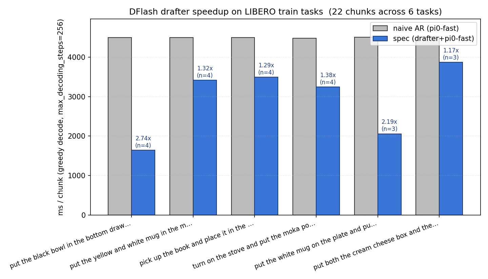

# Speculative decoding for pi0-fast on LIBERO

A small **DFlash-style block-diffusion drafter** that proposes blocks of FAST action tokens in parallel for the autoregressive **pi0-fast** vision-language-action model, accelerating end-to-end action decoding on the LIBERO benchmark.

The drafter is the only thing trained — `pi0-fast` itself stays frozen.

## Results



Per-chunk decode latency on LIBERO val tasks (`max_decoding_steps=256`, greedy decode). Grey bars are naive autoregressive pi0-fast; blue bars are speculative decoding (drafter + pi0-fast verifier); annotations are per-task speedups.

Headline numbers from the best checkpoint (commit `9aaff92`, branch `autoresearch/may1`):

| Metric | Value |
|---|---|
| `accept_len` (teacher-forced, primary metric) | **5.25 / 8** |
| `real_accept_len` (non-teacher-forced) | 5.98 / 8 |
| `speedup` (per-chunk wall clock) | **4.12×** |
| Drafter parameters | 98.6 M (1 transformer block) |
| Target (pi0-fast) | frozen, 3 B params |

`accept_len` ∈ `[1.0, block_size]` measures the mean number of drafted tokens accepted per block under teacher-forced verification — 1.0 means only the verifier's bonus token gets through, `block_size` means every drafted block is fully accepted.

## What's in the drafter

- **One transformer block** (Qwen3-style: GQA with 16 heads / 4 KV heads, SwiGLU MLP, RoPE).
- **Cross-attention to all 18 layers of the frozen pi0-fast Gemma trunk** via DFlash's `extract_context_feature` concat.
- **Block size = 8 FAST action tokens** masked in parallel; position 0 is the verifier's hand-off token, the drafter predicts 1..7.
- Trained for a fixed 15-minute wall-clock budget per experiment on a single A100, AdamW + cosine LR, batch size 8, `inner_steps=4`.

The full architecture, masking, optimizer, and training loop live in [`scripts/train.py`](scripts/train.py). The frozen-target wiring and the fixed acceptance-length metric live in [`src/prepare.py`](src/prepare.py).

## Setup

See [INSTALLATION.md](INSTALLATION.md). TL;DR:

```bash
uv sync
uv pip install "./3rd-party/dflash[transformers]"
uv pip install -e "./3rd-party/lerobot[pi,libero]"
uv pip uninstall torchcodec && uv pip install "av>=14"
uv run src/prepare.py            # one-time HF artifact download (~30 GB)
```

The torchcodec → pyav swap is necessary; the AV1-encoded LIBERO videos don't decode through the pip torchcodec wheel. INSTALLATION.md documents the gotcha in full.

## Reproducing the headline result

```bash
# Train the drafter (~15 min on A100; writes ~/.cache/autoresearch/drafter.pt)
uv run scripts/train.py

# Benchmark spec-decode vs naive AR (~30 s)
uv run scripts/bench.py
```

The training-time accept length (`accept_len`) and the bench-time wall-clock speedup (`speedup`) are the two numbers reported.

## Repo layout

```
src/
  prepare.py         — fixed constants, dataloader, frozen target, eval metric (read-only)
scripts/
  train.py           — drafter architecture (inlined), training loop (the file you edit)
  bench.py           — spec-decode vs naive AR speedup benchmark
  demo.py            — per-chunk decode demo (naive vs spec)
  demo_libero.py     — full LIBERO episode video demo
  save_videos.py     — render side-by-side decoder videos
3rd-party/
  dflash/            — vendored DFlash package (block-diffusion drafter family)
  lerobot/           — vendored lerobot (required for pi0-fast policy & LIBERO dataset)
results.tsv          — append-only experiment log (untracked; written during runs)
program.md           — autonomous-research procedure (see AGENT_GUIDE.md)
```

## Autonomous research

The project was built to be driven by an autonomous coding agent that iterates on `scripts/train.py` in a tight train→bench→keep-or-revert loop. The headline result above is the artifact of ~30 such experiments on the `autoresearch/may1` branch — see `results.tsv` on that branch for the full log.

If you want to run that loop yourself, read [AGENT_GUIDE.md](AGENT_GUIDE.md) and point Claude/Codex/your-agent at [program.md](program.md).

## Platform

Single NVIDIA GPU, ≥24 GB VRAM (pi0-fast itself eats ~12 GB; the drafter and batch share the rest). Tested on A100 40 GB. No CPU / MPS / multi-GPU support.

## References

- pi0-fast: [Black et al., 2024](https://www.physicalintelligence.company/research/fast) — the frozen VLA being accelerated.
- DFlash: [z-lab/dflash](https://github.com/z-lab/dflash) — block-diffusion drafter framework this work is based on.
- FAST tokenization: [lerobot/fast-action-tokenizer](https://huggingface.co/lerobot/fast-action-tokenizer).
- Speculative decoding: [Leviathan et al., 2023](https://arxiv.org/abs/2211.17192) — the verifier protocol used at bench time.
- autoresearch scaffold: forked from [karpathy/autoresearch](https://github.com/karpathy/autoresearch).

## License

MIT (matches upstream autoresearch).
